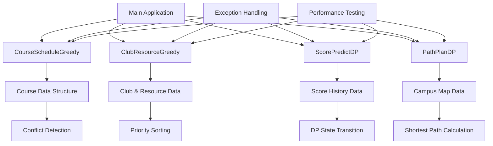

# 学生系统后端核心模块设计文档

## 系统架构



## 核心模块设计

### 1. CourseScheduleGreedy (课程表优化)
- **算法**: 贪心算法
- **时间复杂度**: O(n²)
- **空间复杂度**: O(n)
- **输入**: 课程偏好列表（编号、时间、学分、优先级）
- **输出**: 无冲突最优课程组合
- **核心逻辑**: 按优先级排序 → 冲突检测 → 贪心选择
- **异常处理**: 输入验证、算法执行异常、数据处理异常

### 2. ClubResourceGreedy (社团资源分配)
- **算法**: 贪心算法
- **时间复杂度**: O(n log n)
- **空间复杂度**: O(n)
- **输入**: 资源总量、社团信息（优先级、历史表现、规模）
- **输出**: 资源分配结果
- **核心逻辑**: 多维度排序 → 资源容量检查 → 贪心分配
- **异常处理**: 资源验证、分配策略异常

### 3. ScorePredictDP (学生成绩预测)
- **算法**: 动态规划
- **时间复杂度**: O(n²)
- **空间复杂度**: O(n²)
- **输入**: 历史成绩、课程难度、学习习惯权重
- **输出**: 未来1-2门课程成绩区间预测
- **核心逻辑**: 状态转移方程 → DP计算 → 区间预测
- **异常处理**: 历史数据验证、预测模型异常

### 4. PathPlanDP (校园路径规划)
- **算法**: 动态规划（Floyd-Warshall变种）
- **时间复杂度**: O(n³)
- **空间复杂度**: O(n²)
- **输入**: 邻接矩阵、起点终点、权重偏好
- **输出**: 最短路径及总代价
- **核心逻辑**: 多维DP → 路径重构 → 权重优化
- **异常处理**: 图连通性验证、路径计算异常

## 数据结构设计

### Course (课程信息)
```cpp
struct Course {
    int courseId;               // 课程编号
    std::string courseName;     // 课程名称
    int startTime;              // 开始时间（分钟）
    int endTime;                // 结束时间（分钟）
    int dayOfWeek;              // 星期几（1-7）
    int credits;                // 学分
    int priority;               // 兴趣优先级（1-10）
};
```

### Club (社团信息)
```cpp
struct Club {
    int clubId;                 // 社团编号
    std::string clubName;       // 社团名称
    int priority;               // 优先级（1-10）
    double historyScore;        // 历史表现分（0-100）
    int activityScale;          // 活动规模（人数）
    int venueNeeded;            // 需要场地数
    double fundNeeded;          // 需要资金额度
};
```

### ScoreRecord (成绩记录)
```cpp
struct ScoreRecord {
    int courseId;               // 课程编号
    std::string courseName;     // 课程名称
    double score;               // 成绩
    double difficulty;          // 课程难度系数（0-1）
    double attendance;          // 出勤率（0-1）
    double homeworkRate;        // 作业完成度（0-1）
};
```

## 异常处理体系

### 异常类层次结构
```cpp
StudentSystemException (基类)
├── InvalidInputException (输入验证异常)
├── AlgorithmException (算法执行异常)
└── DataProcessingException (数据处理异常)
```

### 异常处理策略
1. **输入验证**: 所有公共接口进行参数验证
2. **异常传播**: 使用标准异常传播机制
3. **错误日志**: 详细的错误信息和错误代码
4. **优雅降级**: 算法失败时提供备选方案

## 性能优化

### 算法优化
1. **课程表优化**: 
   - 预排序减少比较次数
   - 早期冲突检测终止
   - 内存池优化

2. **社团资源分配**:
   - 快速排序算法
   - 资源预分配策略
   - 批量处理优化

3. **成绩预测**:
   - 状态压缩DP
   - 滚动数组优化
   - 计算缓存机制

4. **路径规划**:
   - 稀疏图优化
   - 路径剪枝策略
   - 并行计算支持

### 内存优化
- 智能指针管理
- 对象池复用
- 内存对齐优化
- 缓存友好的数据布局

## 接口清单

### CourseScheduleGreedy
- `std::vector<Course> optimizeSchedule(std::vector<Course>& courses)` - 主优化函数
- `bool hasTimeConflict(const Course& a, const Course& b)` - 冲突检测
- `void printScheduleResult(const std::vector<Course>& result)` - 结果输出
- `void validateInput(const std::vector<Course>& courses)` - 输入验证

### ClubResourceGreedy
- `std::vector<AllocationResult> allocateResources(std::vector<Club>& clubs, int venues, double funds)` - 资源分配
- `bool canAllocate(const Club& club, int availableVenues, double availableFunds)` - 分配检查
- `void printAllocationResult(const std::vector<AllocationResult>& results)` - 结果输出

### ScorePredictDP
- `std::pair<double, double> predictScoreRange(std::vector<ScoreRecord>& history, double difficulty, double attendance, double homeworkRate)` - 成绩预测
- `std::vector<std::pair<double, double>> predictMultipleCourses(...)` - 多课程预测
- `void printPredictionResult(const std::pair<double, double>& range, ...)` - 结果输出

### PathPlanDP
- `PathResult findOptimalPath(std::vector<std::vector<double>>& graph, std::vector<CampusNode>& nodeInfo, int start, int end, ...)` - 路径规划
- `void updatePathWeights(...)` - 权重更新
- `void printPathResult(const PathResult& result, const std::vector<CampusNode>& nodeInfo)` - 结果输出

## 编译配置

### Visual Studio 2022 项目设置
- **项目类型**: 控制台应用程序
- **C++标准**: C++17或更高
- **字符集**: Unicode
- **运行时库**: 多线程DLL (/MD)
- **优化**: Release模式启用O2优化

### 依赖库
- 标准库容器: `<vector>`, `<map>`, `<algorithm>`
- 输入输出: `<iostream>`, `<iomanip>`
- 字符串处理: `<string>`, `<sstream>`
- 异常处理: `<stdexcept>`, `<exception>`
- 性能测试: `<chrono>`, `<random>`

## 测试策略

### 单元测试
- **边界条件测试**: 空输入、极值输入
- **异常处理测试**: 非法输入、系统异常
- **算法正确性测试**: 已知输入输出验证

### 性能测试
- **小规模测试**: n ≤ 100
- **中等规模测试**: 100 < n ≤ 1000
- **大规模测试**: n > 1000
- **复杂度验证**: 实际运行时间与理论复杂度对比

### 集成测试
- **模块间协作测试**: 数据流转验证
- **系统级测试**: 完整流程测试
- **压力测试**: 高并发、大数据量测试

## 代码质量标准

### 编码规范
- **命名空间**: 使用完整的std::命名空间限定符
- **异常安全**: RAII原则，异常安全保证
- **内存管理**: 智能指针，避免内存泄漏
- **代码注释**: 详细的函数和类注释

### 性能指标
- **课程表优化**: n=1000时 < 100ms
- **社团资源分配**: n=5000时 < 50ms
- **成绩预测**: n=100时 < 20ms
- **路径规划**: n=100时 < 500ms

### 质量保证
- **代码覆盖率**: > 90%
- **内存泄漏**: 零泄漏
- **异常安全**: 强异常安全保证
- **线程安全**: 明确的线程安全策略